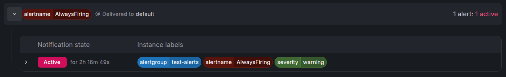

# Monitoring VictoriaMetrics Components

1. The next task was to find ready-made Grafana dashboards for VictoriaMetrics components such as VMSingle and VMAgent and display their operational metrics.
   In my setup, the active endpoints included:

- vmsingle-main:8429/metrics
- vmagent-main:8429/metrics
- vmauth-main:8427/metrics
  These endpoints provide information about **resource usage**, **requests**, **errors**, **storage operations** and **component health**.
  The VictoriaMetrics Operator automatically created a Kubernetes `Service` and `VMServiceScrape` for each VictoriaMetrics component.
  However, my VMAgent originally selected scrape objects only from the `cluster-manager` namespace:

```yaml
spec:
	selectAllByDefault: false
	serviceScrapeSelector:
		matchLabels:
			monitoring: cluster-manager
	serviceScrapeNamespaceSelector:
		matchLabels:
			kubernetes.io/metadata.name: cluster-manager
```

I changed the namespace selector to include both namespaces:

```yaml
spec:
	selectAllByDefault: false
	serviceScrapeSelector: {}
	serviceScrapeNamespaceSelector:
		matchExpressions:
			- key: kubernetes.io/metadata.name
			operator: In
			values:
				- cluster-manager
				- monitoring-system
```

The namespaces have different purposes:

- `cluster-manager` contains the backend `VMServiceScrape`.
- `monitoring-system` contains the VMSingle, VMAgent and VMAuth scrape objects.
  Finally, I used the official ready-made Grafana dashboards:
- VMSingle dashboard: `10229`
- VMAgent dashboard: `12683`

# Building the Alerting Pipeline

The next task was building an alerting pipeline using VictoriaMetrics components and testing the complete flow with an alert that always fires.
The pipeline was:

```
VMRule → VMAlert → VMAlertmanager → Grafana
```

- `VMRule` defines the alert condition.
- `VMAlert` evaluates the rule.
- `VMAlertmanager` receives and manages firing alerts.
- `Grafana` reads the active alerts from VMAlertmanager and displays them.

## Alertmanager configuration Secret

First, I created an Alertmanager configuration Secret.

```
group_by: - alertname group_wait: 1s group_interval: 5s repeat_interval: 1m
receivers:
	- name: default
```

The route groups alerts with the same `alertname` and sends them to the `default` receiver. Since this receiver has no webhook configuration, it receives the alert without sending an external notification.

## VMAlertmanager

The Operator creates the required StatefulSet, Pod, Service, and PVC.
I ran into an error:
Initially, I placed accessModes directly under storage. The admission webhook rejected the manifest because VMAlertmanager expects a volumeClaimTemplate. I fixed the storage structure by placing the PVC specification under:

```
storage:
	volumeClaimTemplate:
		spec:
```

## VMAlert

After that, I deployed `VMAlert`. It reads metrics from VMSingle, evaluates selected rules every ten seconds, and sends firing alerts to VMAlertmanager.

```
selectAllByDefault: false
ruleSelector:
	matchLabels:
		alerting: main
ruleNamespaceSelector:
	matchLabels:
		kubernetes.io/metadata.name: monitoring-system
```

The selectors mean that this VMAlert uses `VMRule` resources that:

- Are located in the `monitoring-system` namespace.
- Have the label `alerting: main`.

## VMRule

I then created an always-firing test rule.

`vector(1)` always returns a result with the value `1`. Therefore, the expression is always considered true. Since the rule has no `for` duration, it enters the firing state immediately after evaluation.

```
spec:
	groups:
	  - name: test-alerts
		interval: 10s
		rules:
		  - alert: AlwaysFiring
			expr: vector(1)
```

`vector(1)` always returns a result with the value 1. Therefore, the expression is always considered true. Since the rule has no for duration, it enters the firing state immediately after evaluation.

## Grafana

Finally, I connected Grafana to VMAlertmanager using an Alertmanager datasource.

